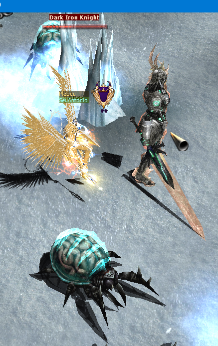
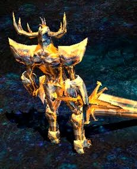
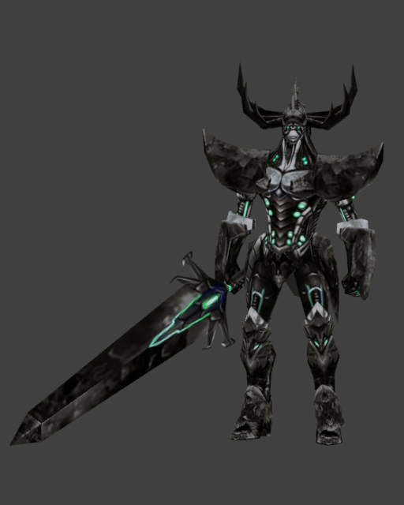
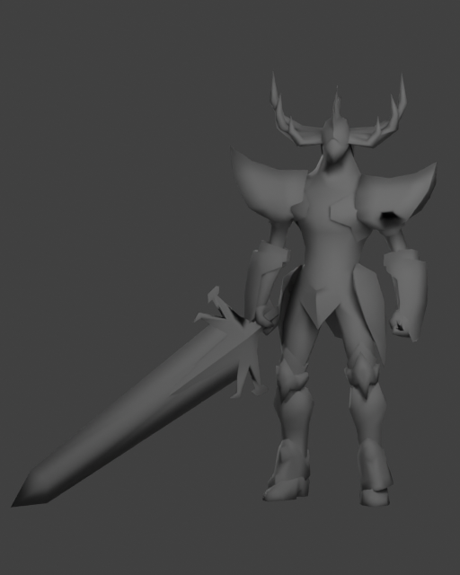
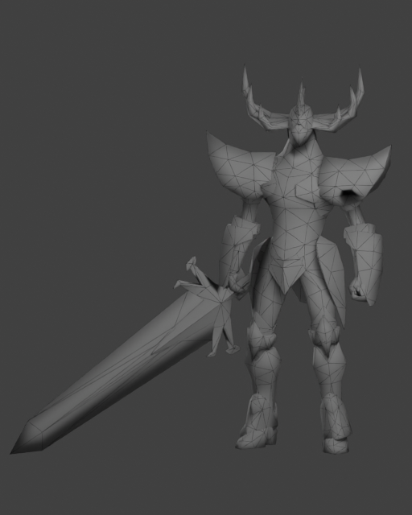
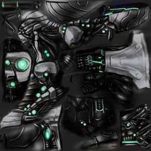
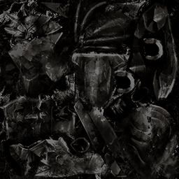
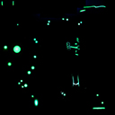
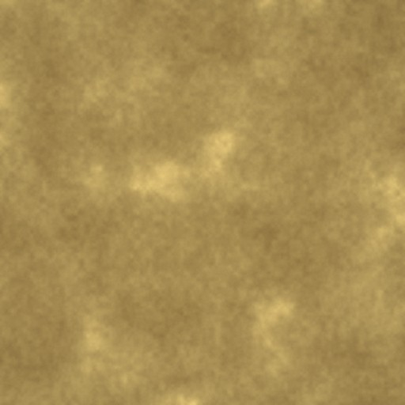

# Dark Iron Knight: de onde vem o detalhe

Inspeção de 11/09/2026, sem editar os assets originais. A principal conclusão é visualmente comprovável: **o cavaleiro usa só 2.126 triângulos; grande parte das gravuras, lâminas sobrepostas e profundidade das botas está pintada no atlas, não esculpida na malha**. O Celestial tem muito mais geometria, mas seus materiais da base analisada quase não têm contraste de placas/rebaixos.

## Referências e identificação

| Captura enviada: Dark Iron Knight | Referência dourada enviada |
|---|---|
|  |  |

A primeira captura contém o nome Dark Iron Knight. A segunda tem silhueta compatível com Iron Knight — chifres laterais, ombreiras em meia-lua e espada larga —, mas não contém nome/ID ou prova da versão do cliente; a associação com Golden Iron Knight é uma identificação visual sustentada pelo modelo, não leitura de estado daquela sessão.

| Variante no código | ID de monstro | Modelo interno | Arquivo carregado | Escala definida |
|---|---:|---|---|---:|
| Iron Knight | 458 | `MODEL_MONSTER01 + 149` | `Data/Monster/Monster150.bmd` | 1,5 |
| Golden Iron Knight | 499 | `MODEL_MONSTER01 + 149` | **O mesmo `Monster150.bmd`** | 1,5 |
| Dark Iron Knight | 565 | `MODEL_MONSTER01 + 208` | `Data/Monster/Monster209.bmd` | 1,8 |

Fontes: [_enum.h](../../../src/source/Core/Globals/_enum.h:4819), [criação de Iron Knight](../../../src/source/World/GameMaps/GM_Raklion.cpp:141), [criação de Dark Iron Knight](../../../src/source/World/GameMaps/GM_Raklion.cpp:236), [criação de Golden Iron Knight](../../../src/source/Engine/Object/ZzzCharacter.cpp:15194). O carregador monta `Monster` + `(Type + 1)` em `Data/Monster` e lê as texturas desse diretório: [ZzzOpenData.cpp](../../../src/source/Engine/Object/ZzzOpenData.cpp:2684). O número absoluto de `MODEL_MONSTER01` depende do enum da revisão; não é confundido aqui com o ID de monstro da rede.

## A prova: textura, malha e triangulação

Estas são prévias diagnósticas dos BMDs reais. A coluna de textura usa os pixels originais sem iluminação; clay e wire usam luz neutra e as normais importadas. **Não reproduzem os passes, transparência e iluminação do MU e não são capturas ingame.**

| Dark: atlas original | Dark: sem atlas, normais originais | Dark: triangulação |
|---|---|---|
|  |  |  |

Observe a bota, o abdômen, os dedos e o peitoral: quando o atlas sai, somem nervuras, pequenas bordas, encaixes e rebaixos. Permanecem a silhueta das ombreiras, os chifres, os grandes volumes de joelho/braço e a lâmina da espada. A lâmina tem planos e mudanças de seção reais; isso não significa que cada borda clara do atlas seja um chanfro geométrico.

As normais também importam: malha 0 tem 671 registros de normais para 540 vértices e malha 1 tem 682 para 663. Respectivamente, 140 e 23 vértices referenciam mais de um índice de normal. Isso comprova representação de normais por canto; **não é uma contagem de chanfros nem prova de que todo índice distinto tenha direção distinta**. A prévia preserva esses valores em vez de recalcular tudo com suavização automática.

O verso também foi conservado para consulta: [Dark traseiro](dark-iron-knight/monster209-texture-rear.png), [Iron traseiro](dark-iron-knight/monster150-texture-rear.png).

## Atlas reais e contraste pintado

| Atlas do corpo Dark — 256 × 256 | Atlas das placas externas Dark — 256 × 256 | Máscara luminosa do carregador — 128 × 128 |
|---|---|---|
|  |  |  |

`ex01icenight.OZJ` tem juntas quase pretas, filetes cinza muito claros, botões/joias verdes, listras de reflexo e sombras de encaixe. `ex01icenight2.OZJ` traz facetas e manchas escuras pintadas nas partes externas. Não há um normal map ou height map ligado a esses materiais no caminho de carregamento examinado: o BMD fornece posições/normais/UV e nomes de texturas; o atlas RGB já contém grande parte da ilusão de relevo.

O Iron normal/Golden usa `icenight.OZJ` e `icenight2.OZJ`; são cinza-azulados, **não dourados**. Veja o [modelo com os atlas originais](dark-iron-knight/monster150-texture-front.png) e o [atlas do corpo](dark-iron-knight/icenight.png). A cor dourada é obtida no renderer.

| Material da base analisada | P05 de luminância | Mediana | P95 | Amplitude P95 − P05 |
|---|---:|---:|---:|---:|
| Dark, corpo `ex01icenight` | 2 | 32 | 162 | 160 |
| Iron, corpo `icenight` | 21 | 64 | 192 | 171 |
| Celestial Gold | 129 | 141 | 161 | 32 |
| Celestial Ivory | 224 | 229 | 233 | 9 |

Valores 0–255 medidos nos pixels dos atlas inteiros; incluem áreas não usadas e não representam luminância final em jogo. A diferença é objetiva: o Ivory é quase todo claro e uniforme. Gold e Ivory têm ruído suave, mas não desenhos de bordas, placas e vincos reconhecíveis como no cavaleiro.

| Celestial Gold, sem alterações | Celestial Ivory, sem alterações |
|---|---|
|  |  |

Paletas dominantes de amostragem do atlas (não substituem as joias pequenas): Dark corpo `#080806`, `#1D1C1B`, `#2C2B29`, `#141412`, `#525453`, `#8C9696`; Iron corpo `#1E1E22`, `#33343A`, `#41424A`, `#4E4F59`, `#6D7180`, `#AEB7CB`. HEX, proporções, hashes, tamanhos e previews completos estão em [measurements.json](dark-iron-knight/measurements.json).

Os overlays permitem relacionar atlas e malha sem adivinhar a pintura: [Dark malha 0/UV](dark-iron-knight/monster209-mesh0-uv.png), [Dark malha 1/UV](dark-iron-knight/monster209-mesh1-uv.png), [Iron malha 0/UV](dark-iron-knight/monster150-mesh0-uv.png), [Iron malha 1/UV](dark-iron-knight/monster150-mesh1-uv.png). São diagramas diagnósticos com as arestas UV sobre uma cópia, não texturas destinadas ao jogo.

## Camadas de brilho, movimento e efeitos

Dark e Iron usam o mesmo esquema básico no [RenderMonster](../../../src/source/World/GameMaps/GM_Raklion.cpp:1673):

1. Malha 0 com textura normal.
2. Malha 0 com `RENDER_TEXTURE | RENDER_BRIGHT`, sobreposição de `BITMAP_IRONKNIGHT_BODY_BRIGHT`. A intensidade `0,4 × (sen(WorldTime × 0,01) + 1) + 0,2` varia de 0,2 a 1,0. A máscara concentra a luz nas pequenas joias e linhas, não em toda a superfície.
3. Malha 1 com textura, alpha 0,4; depois textura bright e chrome bright. Esta separação permite que placas externas tenham reflexo diferente do corpo.
4. Na morte, esse trecho desenha somente a malha 0 com textura normal.

A máscara efetivamente carregada é `Data/Monster/icenightlight.OZJ`, declarada como `icenightlight.jpg`: [ZzzOpenData.cpp](../../../src/source/Engine/Object/ZzzOpenData.cpp:5492). `ex01icenightlight.OZJ` também existe na base e está extraída para referência, mas **não é a máscara vinculada pelo carregador encontrado**. Presença de arquivo não comprova uso.

Golden 499 reaproveita a geometria/atlas do Iron normal e entra no ramo de monstros dourados 493–502: [ZzzCharacter.cpp](../../../src/source/Engine/Object/ZzzCharacter.cpp:8865). Ali existem passes adicionais `RENDER_METAL | RENDER_BRIGHT` e `RENDER_CHROME | RENDER_BRIGHT`. A atribuição local de `BodyLight` não deve ser tratada isoladamente como RGB final: a função chamada também pode aplicar a cor do material. O acompanhamento dessa chamada está separado no [estudo do runtime Golden](golden-runtime.md), sem presumir equivalência entre o render Blender e o jogo.

Ambos os BMDs têm 58 ossos reais e 7 ações, com quadros `[8, 8, 8, 8, 9, 5, 12]`; os 58 ossos têm movimento/rotação em alguma ação. O rig/animações medidos são idênticos entre 150 e 209. Faces, UVs e índices de normais também são idênticos; posições e vetores de normais não são byte a byte iguais, portanto os modelos **não** foram declarados clones geométricos exatos.

Velocidades específicas: caminhada 0,25; ataque 1 = 0,21; morte 0,23, nos [ajustes do Iron](../../../src/source/Engine/Object/ZzzOpenData.cpp:3146) e [Dark](../../../src/source/Engine/Object/ZzzOpenData.cpp:3387). Esses números são incrementos usados pela animação do cliente, não FPS dos clips. O fluxo visual também cria rastro de espada pelos ossos 35–36 e partículas presas aos ossos 20/37/45/51: [GM_Raklion.cpp](../../../src/source/World/GameMaps/GM_Raklion.cpp:2058). Sons referenciam `Data/Sound/w58w59/IronKnight_move.wav` e `IronKnight_attack.wav`; esta inspeção não testou reprodução de áudio.

## Custo comparado ao Celestial

| Arquivo/conjunto medido | Triângulos | Relação com o monstro inteiro |
|---|---:|---:|
| Iron/Dark completo, incluindo a arma da malha | 2.126 | 1,0× |
| Cinco peças de armadura Celestial | 39.486 | 18,6× |
| Celestial Staff | 10.636 | 5,0× |
| Celestial Shield | 8.494 | 4,0× |
| Celestial Wings | 28.870 | 13,6× |
| Celestial Pendant | 7.594 | 3,6× |
| Celestial Ring, um arquivo | 6.172 | 2,9× |
| Dez BMDs Celestial, um de cada | **101.252** | **47,6×** |

O total de arquivos não equivale a triângulos visíveis por frame: anéis/pendant normalmente não viram malhas do corpo, dois anéis não significam dois BMDs distintos e passes de material podem desenhar a mesma superfície várias vezes. A soma das cinco peças + staff + shield + wings é 87.486 triângulos, antes de considerar personagem-base, culling e repetições de passes. O cavaleiro vivo também repete malhas em passes; a tabela compara geometria-fonte, não benchmark de FPS.

## Aplicação ao acabamento do Celestial

Prioridade recomendada, sem propor copiar a arte do cavaleiro:

1. Usar UVs das peças para pintar recessos âmbar/bronze, bordas quentes claras e sombras de sobreposição. Um ruído genérico sobre todo o objeto não cria leitura de placas.
2. Reservar geometria para contorno e mudanças de plano realmente visíveis: bico/calcanhar da bota, chapa frontal, joelhos, chifres e grandes abas. Não tentar modelar cada risco fino com dezenas de milhares de triângulos.
3. Preservar facetas e normais intencionais. Somente iluminar uma superfície uniformemente branca não revela suas divisões.
4. Colocar reflexão metálica no ouro e reservar emissão para cristais, filetes e focos pequenos. Fazer o Ivory inteiro aditivo remove ainda mais os rebaixos, em vez de produzir metal.
5. Avaliar no tamanho do personagem ingame: o Dark da captura já mostra que poucas faixas de alto contraste sobrevivem melhor à distância do que ruído fino.

Estas recomendações são inferências apoiadas nas comparações acima; não alegam teste ingame do Celestial modificado.

## Conferência do novo acabamento preparado em paralelo

As novas imagens `art-source/celestial/textures/Celestial_Gold.jpg` e `Celestial_Ivory.jpg` foram inspecionadas visualmente e lidas sem edição nesta auditoria. Ambas continuam JPEG RGB 512 × 512. Ouro agora contém arabescos gravados com sulco escuro e borda clara; Ivory passou de marfim quase uniforme a cinza metálico com ornamentos. Não foi acrescentada geometria nesta comparação.

| Material | P05 / mediana / P95 anteriores | P05 / mediana / P95 novos | Amplitude anterior → nova |
|---|---|---|---|
| Gold | 129 / 141 / 161 | 83 / 156 / 209 | 32 → 126 (3,94×) |
| Ivory | 224 / 229 / 233 | 63 / 106 / 153 | 9 → 90 (10×) |

A pintura nova resolve a falta de contraste no bitmap. Ainda precisa de validação da escala e continuidade das gravuras nas UVs do conjunto, além do brilho no renderer: é um padrão ornamental repetido, não um atlas anatômico por peça como `ex01icenight`. Os valores medem contraste estático, não ganho de qualidade/FPS nem intensidade de luz em jogo. O arquivo de referência anterior permanece separado e não foi substituído pelas imagens novas.

Evidências: [finish-texture-comparison.json](dark-iron-knight/finish-texture-comparison.json). Gold novo SHA256 `04bc75b20050bc5b89f68bf919b29b2cd30295e7568f809382aa00dd444c653c`; Ivory novo `e8ff633b7be8ee83d5aef49d3e903c71cf48bd231c75b9d8edd375c1ae4f6379`. O comparador produz somente JSON, sem salvar ou alterar bitmaps:

```powershell
python tools/armor_catalog/compare_finish_textures.py --baseline art-source/celestial/research/dark-iron-knight/measurements.json --textures art-source/celestial/textures --output art-source/celestial/research/dark-iron-knight/finish-texture-comparison.json
```

## Proveniência, reprodução e limites

Base fixa: `scratchpad/celestial-golden-20260911/golden-base-downloaded.zip`, SHA256 `10141413669b3e061a7082c4933cec4902f03f7540cf73e1526fa65442e426ed`. Monster150: `188f8d281f96a6dcfbf61d84d0ea45e83ef54e247467a16c0f2cc2c0d6ac751a`; Monster209: `c67c060c927d0c98cb391a22e1f83809d25f0e9e4fe2985636a543fb8d57f433`.

Foram medidos 12 modelos, decodificadas 13 referências de texturas (10 arquivos únicos, pois os três materiais Celestial em Player/Item são idênticos), criados quatro overlays UV e oito renders diagnósticos. As duas referências enviadas foram copiadas sem alteração. O ZIP permaneceu com o mesmo hash; os assets originais e o catálogo congelado não foram modificados. O parser compartilhado foi reutilizado sem mudanças. As prévias preservam normais/UVs e não aplicam os passes do MU.

```powershell
python tools/armor_catalog/inspect_knight_reference.py --archive 'C:/Users/joaop/Desenvolvimento/openmu/scratchpad/celestial-golden-20260911/golden-base-downloaded.zip' --output 'C:/_wt-celestial-client/art-source/celestial/research/dark-iron-knight'
& 'C:/Program Files/Blender Foundation/Blender 4.2/blender.exe' -b --python tools/armor_catalog/render_knight_reference.py -- --archive 'C:/Users/joaop/Desenvolvimento/openmu/scratchpad/celestial-golden-20260911/golden-base-downloaded.zip' --output 'C:/_wt-celestial-client/art-source/celestial/research/dark-iron-knight'
python -m unittest discover -s tools/armor_catalog -p test_knight_reference.py -v
```

Complementos: [relatório de render](dark-iron-knight/render-report.json), [catálogo geral](../../../docs/art/armor-reference/catalog.md), [guia de renderer/equipamentos](../../../docs/art/armor-reference/runtime-guide.md). A inspeção de código/arquivos não substitui validação de iluminação e desempenho no cliente real.
