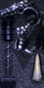
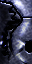

# Staff of Kundun: prata do atlas e reflexo do renderer

Inspeção local da base Golden Metal de 11/09/2026. **É adequado testar o acabamento platinado do Celestial alterando somente os reflexos do material Ivory, sem substituir o JPEG nem tocar no ouro.** O Kundun já possui prata/cinza frio pintado, mas a aparência brilhante de Excellent +15 depende também dos passes de reflexão. O Ivory atual já fornece uma base cinza neutra gravada; clareá-lo para branco reduziria o contraste das gravações.

## Arquivo e componentes reais

Item grupo 5, número 11 → `MODEL_STAFF_OF_KUNDUN = MODEL_STAFF + 11` → `Data/Item/Staff12.bmd`. Fontes: [_enum.h](../../../src/source/Core/Globals/_enum.h:1613) e [carregamento Staff12](../../../src/source/Engine/Object/ZzzOpenData.cpp:761). Nome embutido do arquivo: `Z:\staff12.smd`.

| Malha | Textura declarada / OZJ real em Data/Item | Vértices | Triângulos | Tamanho do atlas |
|---|---|---:|---:|---|
| 0 | `kundunStic_R.jpg` / `kundunStic_R.OZJ` | 66 | 72 | 32 × 64 |
| 1 | `kundunStic.jpg` / `kundunStic.OZJ` | 442 | 743 | 64 × 128 |
| 2 | `kundunStic2.jpg` / `kundunStic2.OZJ` | 43 | 78 | 32 × 64 |
| **Total** | Três malhas | **551** | **893** | — |

O BMD contém nove ossos e uma ação de um quadro, sem animação esquelética própria em sequência. Os vértices das três malhas usam o osso 0; outros ossos servem de referências para efeitos, como os sprites presos aos ossos 5/6 no [tratamento do Kundun](../../../src/source/Engine/Object/ZzzCharacter.cpp:7574). Movimento do cajado equipado e efeitos de tempo não devem ser confundidos com quadros adicionais nesse BMD.

## O que está pintado

| Corpo original | Complemento original | Linhas luminosas originais |
|---|---|---|
|  |  |  |

O corpo é cinza/prata com tendência azul-arroxeada, juntas escuras e brilhos claros pintados. O complemento também traz tons azul-cinza. A terceira textura é uma máscara preta com contornos ciano. `_R` é um nome funcional: o [parser de script de textura](../../../src/source/Render/Sprites/TextureScript.cpp:16) habilita o tratamento bright. Não é um sufixo que deva ser removido/renomeado casualmente.

| Atlas | P05 / mediana / P95 de luminância |
|---|---|
| kundunStic | 8 / 42 / 133 |
| kundunStic2 | 0 / 47 / 189 |
| Ivory Celestial já publicado | 63 / 106 / 153 |

Medições 0–255 dos pixels inteiros do atlas, não da iluminação em jogo. O corpo do Kundun é **mais escuro na mediana** que o Ivory atual; o aspecto platinado não exige que a textura base seja branca. Paleta dominante do corpo: `#0B0D17`, `#3D4058`, `#2E3044`, `#222333`, `#1A1B29`, `#797A92`. As áreas claras pequenas não dominam essa amostragem. O [Ivory atual extraído da mesma base](kundun-staff/Celestial_Ivory.png) conserva gravações e cinzas neutros.

## O que o renderer acrescenta

O [bloco específico do Kundun](../../../src/source/Engine/Object/ZzzObject.cpp:8106) desenha a base, acrescenta `CHROME | BRIGHT` na malha 1 e usa textura bright pulsante mais `CHROME4 | BRIGHT` na malha 0. Portanto nem todo detalhe luminoso vem do atlas, e nem todo brilho é consequência exclusiva do +15.

O tint fixo de `PartObjectColor` para esse cajado é `Color = 17`, que vira `(0,65; 0,45; 0,3)` — bronze, **não platina**: [seleção](../../../src/source/Engine/Object/ZzzObject.cpp:6721), [RGB](../../../src/source/Engine/Object/ZzzObject.cpp:6908). Copiar essa cor literalmente para o Ivory não atende ao objetivo. O estudo de runtime conduzido em paralelo separa ainda os passes genéricos de +15, as variações Excellent e os sprites específicos do cajado.

Mapas de reflexão nativos extraídos: [Chrome01, 64 × 64](kundun-staff/Chrome01.png), [Chrome02](kundun-staff/Chrome02.png) e [Shiny01, 16 × 16](kundun-staff/Shiny01.png). São recursos diferentes do atlas difuso. `CHROME4` usa `BITMAP_CHROME2`, carregado de `Effect/Chrome02.jpg`: [carregamento](../../../src/source/Engine/Object/ZzzOpenData.cpp:5550), [seleção no renderer](../../../src/source/Render/Models/ZzzBMD.cpp:1481). Chrome02 contém reflexo branco/ciano; mesmo um tint neutro pode produzir highlight frio.

Recomendação delimitada: manter todos os atlas/malhas/UVs; ajustar apenas os passes do material `Celestial_Ivory.jpg` para reflexo neutro/platinado e preservar o perfil Gold. Isso é uma **adaptação da linguagem de reflexo do Kundun**, não promessa de cópia literal de todos os efeitos Excellent +15. Evitar copiar os flashes ciano, a variação de cor Excellent ou o tint bronze para todas as placas. A força e a leitura das gravações precisam ser conferidas ingame.

## Evidências e preservação

Base: `scratchpad/celestial-golden-metal-20260911/golden-metal-base-downloaded.zip`, SHA256 `3600ab2fd60160fe9a835d0b1abc26f0620c4fa10699b8be22432f001719047f`. Staff12 SHA256 `5da22073e810b1e1d4f9c4ac0101aa3414d898ec55bb38264bbee17c35db7c39`.

[measurements.json](kundun-staff/measurements.json) registra malhas, ossos, hashes, atlas e paletas. As sete imagens PNG são cópias decodificadas sem repintura. O ZIP permaneceu com o mesmo hash; não houve edição de JPEG/OZJ/BMD original, alteração de runtime ou deploy nesta auditoria. A extração é reproduzível:

```powershell
python art-source/celestial/research/kundun-staff/inspect_assets.py --archive 'C:/Users/joaop/Desenvolvimento/openmu/scratchpad/celestial-golden-metal-20260911/golden-metal-base-downloaded.zip'
```
